# Log Insight 存儲基礎知識


# 存儲日誌方式
我們首先來看一下vRealize Log Insight如何存儲日誌

## 存儲桶
Log Insight**通過Syslog**或它**自己的收集API**（稱為**CFAPI**）收集日誌數據。收到新的日誌訊息後，它將**被解析並存儲在存儲桶(Bucket)中**。

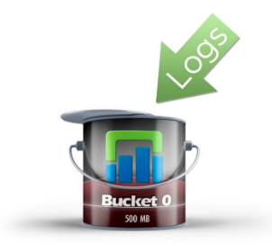

**存儲桶大小**一旦達到**500 MB**，就會被標記為唯讀（密封），並為新訊息創建一個全新的存儲桶。

## 封存
如果啟用了封存歸檔(archiving)，則將整個存儲桶的副本寫入NFS共享。重複此過程，直到Log Insight存儲空間不足。

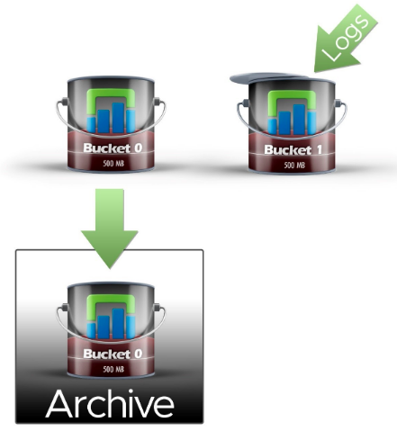

**注意**

- 封存資料時，Log Insight 會在密封值區時，將原始壓縮記錄檔從值區複製到 NFS 掛接。**無法追溯封存未啟用資料封存時所密封的儲存桶(Bucket)**。 

- 如果 NFS 掛接沒有足夠可用空間，或無法使用的時間超過虛擬應用裝置的保留期間， Log Insight 會停止擷取新資料。NFS 掛接具有足夠的可用空間、狀態變為可用或停用封存時，將會再次開始擷取資料。

- 請勿永久掛接 NFS，或變更 /etc/fstab 檔案。vRealize Log Insight 本身會為您執行 NFS 掛接。 

有關封存設定資料，請參考[官方文件說明](https://docs.vmware.com/tw/vRealize-Log-Insight/8.1/com.vmware.log-insight.administration.doc/GUID-225A58FA-E907-4056-8ED4-6D77C50D3377.html)。

## 空間不足
如果Log Insight**存儲空間不足時，最舊的存儲桶將被老化（刪除）**，以便為新存儲桶騰出空間。如果啟用了**封存歸檔(archiving)**，則**歸檔副本將在外部NFS共享上保持不變**。

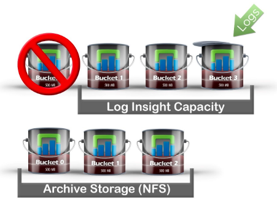

以上的存儲日誌的方式及啟用封存歸檔後，只要Log Insight本身的存儲空間足夠，依舊可以透過管理界面查詢到相關紀錄的。至於要日誌存放多少的需求，可以評估規劃NFS封存空間即可。

# 查詢日誌存儲桶
透過上一節提到的日誌存儲方式，我們可透過實際SSH連線至Log Insight主機，了解目前存儲桶的狀態。

## 命令查詢

執行以下的命令將會列出現在所有的存儲桶，而這些存儲桶正是我們之前提到Log Insight存放日誌的地方。

```bash
# /usr/lib/loginsight/application/sbin/bucket-index show

```

以下是執行命令後輸出的紀錄。

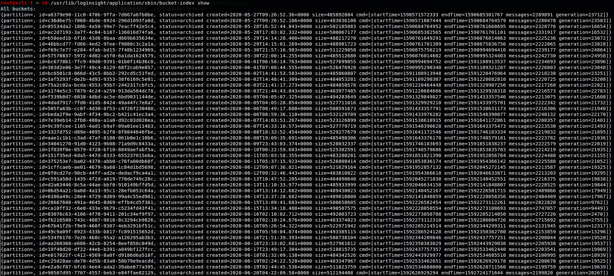

## 資料說明

每筆紀錄包含以下項目：

- **id**：亂數產生的編碼，根據此識別碼，可在
/storage/core/loginsight/cidata/store/目錄中找到識別碼相同的目錄。
- **status**: 儲存桶狀態，有archived跟active兩種狀態。
- **created**: 儲存桶建立時間。注意格式使用的時區是UTC(+0000)。
- **startTime**/**endTime**: 儲存桶使用時間。注意格式使用的是UNIX時間戳記。時區會採用Log Insight設定的時區組態。
- **size**: 儲存桶容量。大約500MB(0.5GB)左右。

由於Log Insight原生儲存桶的紀錄較不易判讀，所以透過撰寫程式進行相關資料轉換。將上述所提相關資訊取出，並將相關時間轉換成本地時區。

# 封存動作

注意: **無法追溯封存未啟用資料封存時所密封的儲存桶(Bucket)**

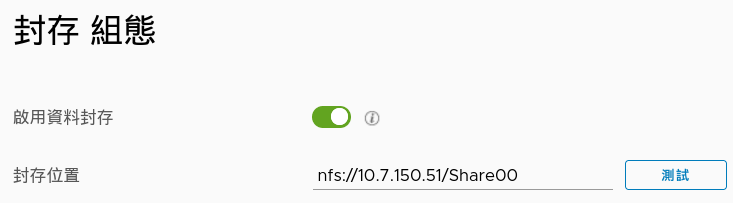

以下是啟用封存功能，顯示封存紀錄的狀態。

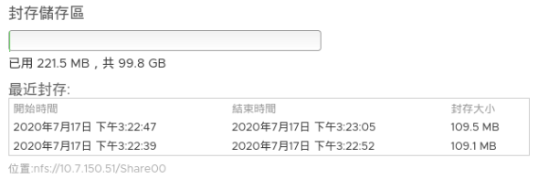

封存匯出內建立的路徑所使用的格式如下，並會使用最初在 UTC 中建立儲存桶時的時間戳記。

> year/month/day/hour/bucketuuid/data.blob

既然知道以上狀況，就可以透過一些方式來檢驗。

## 從NFS掛載空間
在封存的NFS空間中，可檢驗Log Insight封存的目錄及項目(**data.blob**)，的確是按照官方文件及管理界面來呈現。

主要項目data.blob大小約為110MB。

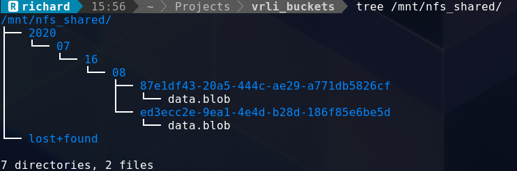
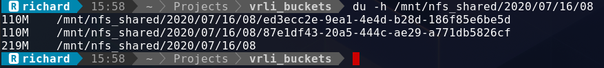

## 從Log Insight主機

可以直接在Log Insight主機中將最後2組儲存桶的內容取得。

- ed3ecc2e-9ea1-4e4d-b28d-186f85e6be5d
- 87e1df43-20a5-444c-ae29-a771db5826cf

```bash
# du -h /storage/core/loginsight/cidata/store/ed3ecc2e-9ea1-4e4d-b28d-186f85e6be5d
# du -h /storage/core/loginsight/cidata/store/87e1df43-20a5-444c-ae29-a771db5826cf
```

# 補充
根據兩天以上的日誌紀錄收集和封存，在Log Insight主機管理界面除了原有的儲存容量，還增加了平均封存速率和封存儲存區預估存放時限。
不過最近封存似乎只會顯示最近3筆紀錄。

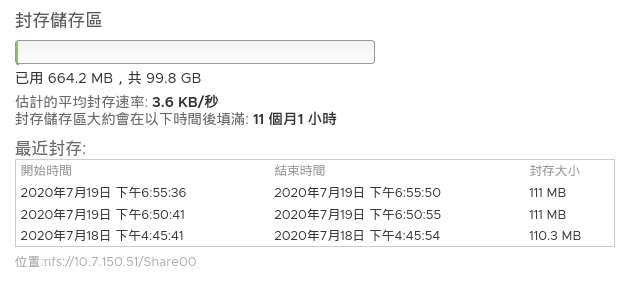

注意：這裡時間顯示為**本地時區**，而**非UTC**。---

# 實作程式

由於Log Insight原生儲存桶的資訊較不易判讀，所以透過撰寫程式進行相關資料轉換。將上述所提相關資訊取出，並將相關時間轉換成本地時區。

- VMware vSphere & vCenter環境
- VMware Log Insight
- SSH連線工具
- 以下撰寫程式以BASH為主，測試Log Insight版本為8.1
 
## 程式執行與說明

根據Log Insight命令資訊及儲存統架構，撰寫出以下程式以便輕鬆取得目前儲存桶運作狀態。

(1) vrliBucketInfo.sh: 取得目前Log Insight主機儲存桶資訊 

> 程式執行前請先配置以下組態檔**li.passport**，其中包含

>> \<loginsight\_ip>:\<root_password>

```
     # cat li.passport
     192.168.1.100:P@ssw0rd
```

 
程式執行結果：

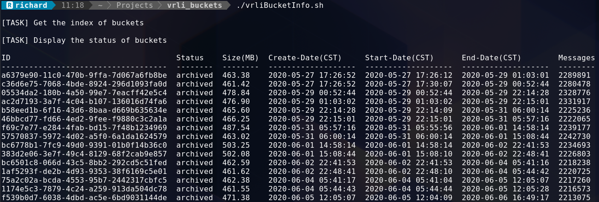
<中間省略>


從結果可以發現目前**儲存桶有94組**，其中**actvie的儲存桶有2組**，**archived的儲存桶有92組**，使用容量約43GB。

> Total: 94    Active: 2    Archived: 92    Size(GB): 43.02

就目前的觀察，Log Insight會保有**2組active狀態的儲存桶**的準備狀態。只要使用的儲存桶填滿，便可立即提供日誌儲存作業。

將最後四筆儲存桶紀錄取出比較。可以看出2組active儲存桶的建立時間，會與最後2組儲存桶結束使用的時間一致。

> 1724f9e6-275b-41ac-afcc-4fd487eaa0eb  archived  463.54  2020-07-15 16:34:46  2020-07-15 16:34:46  **2020-07-16 16:09:45**  2289681

> f9d69f6f-ebb5-4576-9a12-538f96eeef87  archived  474.45  2020-07-15 16:37:15  2020-07-15 16:37:15  **2020-07-16 16:10:34**  2284947

> ed3ecc2e-9ea1-4e4d-b28d-186f85e6be5d  active    0  **2020-07-16 16:09:45**  --  --  -- 

> 87e1df43-20a5-444c-ae29-a771db5826cf  active    0  **2020-07-16 16:10:34**  --   --   --

(2) getBucket.sh: 取得最後n個儲存桶檔案系統架構。預設n=1

程式執行結果：

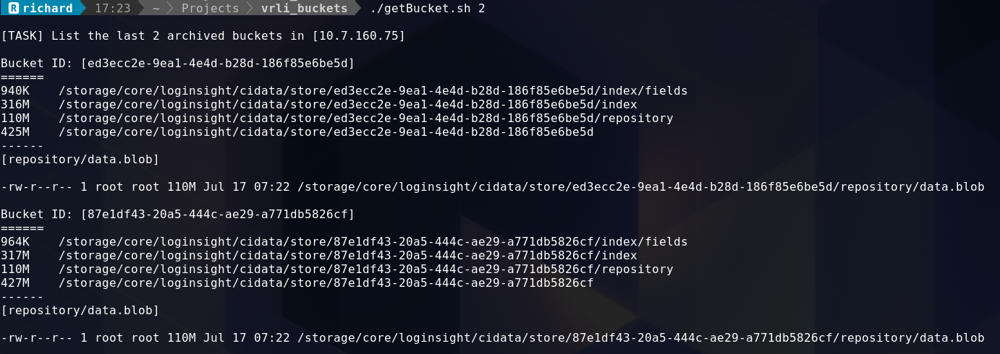

這2組儲存桶識別碼正是封存項目中紀錄的目錄。其中封存的對象就是在Log Insight主機中repository/data.blob。

所以，**封存的紀錄依舊存在於Log Insight主機當中，所以使用者仍是可以在管理界面中查詢到相關日誌紀錄**。


(3) showArchive.sh: 取得NFS封存日誌紀錄資訊
> 程式執行前請先配置以下組態檔**my.passport**，其中包含

>> \<root_password>

```
     # cat my.passport
     root123
```

間單使用此程式便可查詢實際儲存狀態，程式執行結果：

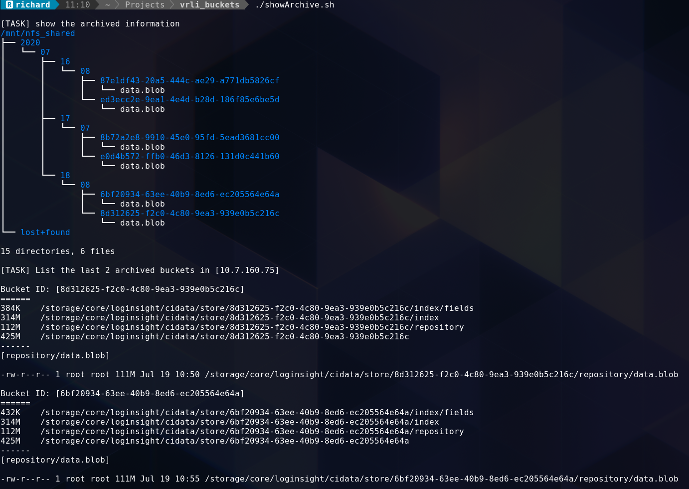

---